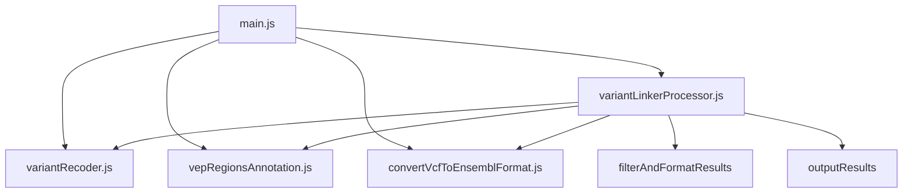

# Variant-Linker: Source Code Overview

This directory contains the core scripts of the Variant-Linker tool. Each script is responsible for a specific part of the functionality. Below is an overview of each script and how they work together.

## Scripts Overview

### main.js

The entry point of the Variant-Linker CLI tool. This script sets up command-line arguments, orchestrates the variant analysis process, and handles output.

- **Functionality**:
  - Sets up command-line arguments using `yargs`.
  - Enables debug mode if specified.
  - Orchestrates the process by calling `processVariantLinking`, `filterAndFormatResults`, and `outputResults`.

### variantRecoder.js

Handles the API call to the Variant Recoder. It fetches the recoded information of a given genetic variant.

- **Functionality**:
  - Sends a request to the Variant Recoder API.
  - Logs the request and response.
  - Returns the recoded variant information, including VCF string.

### vepRegionsAnnotation.js

Handles the API call to VEP (Variant Effect Predictor) using genomic coordinates. It retrieves VEP annotations for a given region and allele.

- **Functionality**:
  - Sends a request to the VEP API using the region endpoint.
  - Logs the request and response.
  - Returns the annotation data.

### convertVcfToEnsemblFormat.js

Converts VCF notation to Ensembl region and allele format required by the VEP API.

- **Functionality**:
  - Parses the VCF string.
  - Converts it to the Ensembl format.
  - Returns the region and allele.

### variantLinkerProcessor.js

Processes the linking between variant recoding and VEP annotations, filters, formats, and outputs the results.

- **Functionality**:
  - Processes variant linking by obtaining data from `variantRecoder` and `vepRegionsAnnotation`.
  - Filters and formats the results based on user input.
  - Outputs the results to either the console or a file.

## How They Work Together

1. **main.js**:
   - Sets up the CLI and parses arguments.
   - Detects input format (VCF or HGVS).
   - Calls `processVariantLinking` with the provided variant, which internally calls `variantRecoder` and `vepRegionsAnnotation`.
   - Calls `filterAndFormatResults` to filter and format the results.
   - Calls `outputResults` to display or save the final results.

2. **variantRecoder.js**:
   - Fetches recoded variant information from the Variant Recoder API, including the VCF string.

3. **vepRegionsAnnotation.js**:
   - Fetches VEP annotations from the VEP API using genomic coordinates.

4. **convertVcfToEnsemblFormat.js**:
   - Converts VCF notation to the required Ensembl format for the VEP API.

5. **variantLinkerProcessor.js**:
   - Orchestrates the data processing, filtering, and formatting.

## Mermaid Diagram



## Example Usage

```bash
node main.js --variant "ENST00000366667:c.803C>T" --output JSON --save results.json --debug
```

This command will analyze the specified variant, format the results as JSON, save them to `results.json`, and enable debug mode.

## Future Enhancements

- Support for additional output formats (e.g., CSV).
- Implement a filter function for more versatile data processing.
- Add local versions of VEP and Variant Recoder as alternatives.

For detailed documentation on each function and module, refer to the JSDoc comments in the source code.
